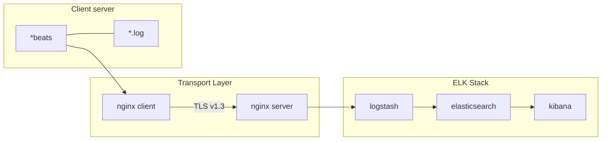

# LogServer

Serwer służący do zbierania logów aplikacji oparty o stos ELK **Elasticseatch>Logstash>Kibana** zapewniający bezpieczne przekazywanie danych w sieci korporacyjnej

## Schemat rozwiązania


## Instrukcja dodania nowej aplikacji do servera logów:

### Przygotowanie
1. Przed przystąpieniem do dodawania nowej maszyny do log serwera należy przygotować:
    - **nazwę aplikacji** pod jaką będzie ona identyfikowana na logserwerze
    - **ip** serwera na którym zanajduje się aplikacja
	- określić **typ aplikacji** (webserver, database, javaapp etc...)
	- określić **silnik aplikacji** (apache, nginx, mssql etc...)
	- określić **typ zbieranych logów** (info, error, system, status)
    - określić **system** na jakim działa aplikacja (windows, linux)
2. Na Logserwerze należy sprawdzić czy są dostępne wolne porty nasłuchu w nginx-server nginx.conf a następnie uzupełnić dane na temat źródła w komentarzu obok definicji serwera - {name}-{ip}-{app_type}-{system}
Jeśli wszystkie porty są wykorzystane należy dodać nowy server słuchający na kolejnym porcie z serii 55xxx i proxujący na port z serii 50xxx
```nginx
server { # {name}-{ip}-{app_type}-{engine}-{log_type}-{system}
    listen 55xxx ssl;
    proxy_pass localhost:50xxx;
}
```
### Konfiguracja po stronie logservera
W katalogu logstash/config należy skonfigurować nowy pipeline. W tym celu należy stworzyć nowy plik o nazwie wg `schematu {name}-{ip}-{app_type}-{engine}-{log_type}-{system}.conf`
W zawartości pliku jako input należy podać port ustawiony w nginx-server skonfigurowanym w proxy_pass:
```nginx
input {
  beats {
    port => %proxy_pass_port%
  }
}
```
w output jako schemat nazewnictwa indexów oraz adres elasticsearch należy podać następującą formułę:
```
output {
  elasticsearch {
    hosts => ["http://localhost:9200"]
    index => "%{[info][appname]}-%{[host][ip]}-%{[info][apptype]}-%{[info][engine]}-%{[info][logtype]}-%{[host][os][platform]}-%{+YYYY.MM.dd}"
  }
}
```
Jeżeli jest taka konieczność należy też ustawić filtry parsujące logi.

Tak przygotowany plik należy dodać jako nowy pipeline w pliku `pipelines.yml` z id wg schematu `{name}-{ip}-{app_type}-{engine}-{log_type}-{system}`
```
- pipeline.id: {name}-{ip}-{app_type}-{engine}-{log_type}-{system}
path.config: "../config/{name}-{ip}-{app_type}-{engine}-{log_type}-{system}.conf"
```

### Przygotowanie maszyny klienckiej
1. Na maszynie z której chcemy pobierać logi zwanej dalej kliencką należy zainstalować aplikację z rodziny beats:
    https://www.elastic.co/downloads/beats
   w zależności od typu logów który chcemy pobierać.
2. Aby zapewnić bezpieczeństwo przesyłu danych należy na niej zainstalować aplikację `nginx` z następującą konfiguracją:
```nginx
worker_processes  1;
events {
    worker_connections  1024;
}
error_log  logs/error.log  info;

stream {
    upstream logstash-proxy {
        server localhost: %LOGSERVER_PROXYPORT%;
    }

    server {
        listen 45000;
        proxy_pass logstash-proxy;
        proxy_ssl on;
        proxy_ssl_certificate         BNP_LOGCLIENT.crt;
        proxy_ssl_certificate_key     BNP_LOGCLIENT.key;
        proxy_ssl_protocols           TLSv1.2 TLSv1.3;
        proxy_ssl_ciphers             ECDHE-ECDSA-AES256-GCM-SHA384:ECDHE-RSA-AES256-GCM-SHA384:ECDHE-ECDSA-CHACHA20-POLY1305:ECDHE-RSA-CHACHA20-POLY1305:DHE-RSA-AES256-GCM-SHA384;
    }
}
```
w miejscu placeholdera `%LOGSERVER_PROXYPORT%` należy wstawić port nasłuchu z konfiguracji nginx-server.

3. Do katalogu nginx/conf należy wgrać certyfikat wygenerowany dla maszyny klienckiej wraz z kluczem prywatnym wygenerowany na podstawie CA skonfigurowanego po stronie serwera. Certyfikat można wygenerować na serwerze za pomocą generatora certyfikatów w katalogu `c:/LogServer/certificates` jako CN należy podać IP maszyny klienckiej.

4. W pliku konfiguracyjnym aplikacji *beats należy:
   - Wskazać źródła danych (w zależności do beats'a)
   - Dodać odpowiedni dla typu aplikacji moduł parsowania danych `- filebeat.modules:`
   - Wskazać tunel gdzie mają być przekazywane dane (logstash) w parametrze `output.logstash` w naszym przypadku musimy podać nginx klienta czyli `hosts: ["localhost:45000"]`
   - Dodać pole z nazwą aplikacji która będzie przekazywana do logstasha w celu wskazania właściwego indeksu:
```yaml
processors:
  - add_fields:
      target: info
      fields:
        appname: %APP_NAME%
        apptype: %APP_TYPE%
		logtype: %LOG_TYPE%
		engine: %ENGINE%
```